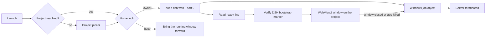

# DeepSeek Harness Desktop App

**A native Windows desktop app for DeepSeek Harness — it starts the harness server on launch, opens straight into your project, and shuts the server down when you close the window.**


DeepSeek Harness normally runs as `dsh web` in a terminal and is opened in a browser tab. This app removes that step: one executable boots the harness, renders its interface in an embedded WebView2 window, and owns the server lifecycle end to end. No terminal, no browser profiles, no manual start or stop.

> **Project status:** this is a working baseline, built and verified against `@deepseek-ai/dsh` 0.1.2-rc.1 on Windows 11. The launch, attach, and shutdown paths are tested. A signed self-update is not implemented yet. See [Current status](#current-status).

---

## Screenshots

*The DeepSeek Harness UI inside the native window, with the window icon and title bar themed to match the page.*


*Window chrome follows the rendered page — dark page, dark title bar.*


## Why this exists

Running the harness by hand means opening a terminal, changing into a project directory, typing a command, copying a tokenized URL, and remembering to stop the server afterwards. That is friction on every session, and it is easy to leave an orphaned server holding a port.

This app turns that sequence into a double-click, and makes the server's lifetime the same as the window's lifetime:

- no terminal and no command to remember;
- the window opens on the project you selected, not a generic dashboard;
- the port is chosen by the operating system, so there is nothing to conflict with;
- closing the window stops the server, and so does crashing the app.

The goal is a dependable desktop shell for a local harness — not a launcher script with a window bolted on.

## What it does

- **No-terminal launch** — starts `dsh web --no-open` as a hidden child process. No console window is ever shown.
- **Fast launch** — the CLI is probed cheaply (0.2 s) instead of being verified with a full `dsh web --help` (7–8 s) before every boot; the deep check runs only as diagnosis when something fails. The embedded browser is warmed while the server boots, the two update checks wait for the first paint, and — with keep-alive on — a later launch attaches to the running server in seconds instead of booting.
- **The harness keeps running** — by default the server outlives the window, so closing and reopening the app is an attach rather than a boot. The tray's "Stop server and exit" and `--stop` end it, and `--no-keep-alive` restores "closing the window stops the server".
- **Remembers your project** — the chosen folder, home, and port are saved to `settings.json`. Later launches open the same project with no flags; the first launch shows a picker with your recent projects.
- **Opens your project** — `--project <dir>` becomes the server's working directory, which is what scopes the harness workspace. The window title shows the project name.
- **OS-assigned port** — starts with `--port 0` and reads the real address from the ready line the harness prints, so port conflicts cannot happen.
- **Verified endpoint** — confirms the served root document contains the DSH bootstrap global before showing it, so an unrelated local service is never embedded.
- **Guaranteed shutdown** — the child is assigned to a Windows job object with kill-on-close. When the app exits, crashes, or is force-killed, the server and its descendants are terminated by the OS.
- **One server per home** — a named mutex keyed by `DSH_HOME` means a second launch hands focus to the running window instead of starting a second writer over the same session files.
- **Tray icon** — present for the whole window lifetime: hide the window to the tray, bring it back, open the project folder or the log directory, see the installed harness version, check for a newer harness, and stop the server.
- **Ordinary window behavior** — minimizing minimizes to the taskbar like any other window; hiding to the tray is an explicit tray-menu action, and closing the window still stops the server.
- **Harness version aware** — on launch it reads the npm `latest` and `alpha` dist-tags once and shows the result in the tray. The check is read-only; installing is a deliberate click that verifies the CLI before the window restarts.
- **Finds the harness wherever npm put it** — the CLI is located the way a shell locates it: the `dsh` shim on `PATH` is read for the entry point it runs, the package's own `package.json` `bin` is honoured, and a global prefix outside `PATH` is found through `npm prefix -g`. A custom npm prefix, a pnpm-style store, or a package layout change therefore still resolves.
- **Repairs a broken harness install** — an interrupted `npm install -g` leaves the package directory behind without the files the CLI needs. The app says exactly that instead of claiming the harness is not installed, and offers to install it; `--update` does the same without asking, and `--repair-harness` does it from a script. Before npm touches a working install, the app moves it aside and puts it back if the result does not validate, so a failed update never costs you a working harness.
- **Update aware** — on launch it also asks GitHub for a newer build of this app, caches the answer for six hours, and announces one when it exists: a tray notification, a line in the tray menu, a pill inside the harness page, and the version in the window title. Detection reads release metadata only.
- **In-app updates** — the Updates section lives inside the harness UI, where this harness expects extensions to live. A bundled DSH plugin registers it into the sidebar (beside Settings) and into Settings itself, and talks to the app through a versioned page bridge (`window.__dshDesktop`). The app keeps what a page must never hold: the download, the checksum verification, the staged swap, and the restart. The native updates window remains as a fallback and as a shortcut from the tray.
- **Plugin management** — the same section installs, switches and removes harness plugins: ours and third-party ones, by npm name, git spec, or local folder. pnpm is carried by the build (extracted from the executable, or fetched with npm when the build shipped without it), so `dsh plugin add` works on a machine that has never installed pnpm. Enable/disable goes through the profile's patch layer, so a plugin can be taken out of the tree without uninstalling it.
- **Safe mode** — a plugin the harness cannot load aborts the whole profile. The app reads the loader's own message, disables the offending plugin, and boots again once, so a bad plugin costs a notification instead of a window that never opens. `--safe-mode` boots with the base bundles only.
- **Staged, never in place** — the running executable is never overwritten while it runs. The download is verified before the swap, the previous build is kept as `<exe>.old` until the new one has stayed up, and a checksum mismatch discards the download outright.
- **Bounded logs** — `desktop.log` rotates at 4 MB and old server logs are pruned at startup.
- **Dedicated data home** — the app uses its own `DSH_HOME` by default and never touches a harness home you did not point it at.
- **Opt-in updates** — `--update` runs `npm install -g @deepseek-ai/dsh@latest` behind a lock and validates the CLI before booting. Without the flag, a launch never mutates a working install.
- **Theme-aware window** — the title bar and border follow the rendered page background, and the window icon follows the Windows theme.

## How it works



### Launch sequence

1. The app loads `settings.json` and resolves the project: `--project`, then the remembered folder, then an interactive picker with the recent list.
2. It resolves `node` and the global `@deepseek-ai/dsh` entry, then validates that the CLI loads.
3. It acquires the per-home mutex. If another instance owns the home, it signals that window to come forward and exits.
4. It spawns `dsh web --no-open --host 127.0.0.1 --port 0` with the project as the working directory and the chosen `DSH_HOME`.
5. The child is assigned to a kill-on-close job object before any output is consumed.
6. The app reads the child's stdout for the ready line — `dsh web: http://127.0.0.1:<port>/?token=<token>` — which carries both the port and the access token.
7. It probes that authenticated URL and requires the DSH bootstrap marker in the root document.
8. The WebView2 window opens on that URL. The lease (PID, start time, port, URL, project) is persisted for other instances, and the resolved choices are saved to `settings.json`.
9. On close, the app kills the exact child it started, disposes the job handle, and removes the lease.

## Requirements

| Requirement | Notes |
|---|---|
| Windows 10/11 x64 | Windows 11 22H2 or newer enables the full title-bar theming |
| WebView2 Runtime | Preinstalled on Windows 11 and most Windows 10 machines; the window shows the official install link if missing |
| Node.js | Required by the harness itself |
| `@deepseek-ai/dsh` | Installed globally: `npm install -g @deepseek-ai/dsh` |
| .NET 8 SDK | Only to build from source; the published portable build bundles the runtime |

## Quick start

### Run a published build

1. Download `DeepSeekHarness-win-x64-<version>.zip` from Releases.
2. Unzip anywhere and run `DeepSeekHarness.exe`.
3. The first launch shows a project picker; choose the folder to open. The choice is remembered.
4. A few seconds later the window opens on that project.

Close the window to stop the server.

### Build from source

```powershell
git clone https://github.com/desanv01/deepseek-harness-desktop-app.git
cd deepseek-harness-desktop-app

# framework-dependent dev build -> dist\ (needs the .NET 8 runtime)
.\build.ps1

# self-contained single-file exe -> release\ (no .NET needed on the target)
.\build_portable.ps1
```

`build_portable.ps1` is a thin alias for `build.ps1 -SingleFile`. Both accept `-RestoreSource` to restore packages from a folder or feed instead of the machine's configured NuGet sources — useful for a disconnected or air-gapped machine:

```powershell
.\build.ps1 -SingleFile -RestoreSource C:\offline-nuget   # folder of .nupkg files
.\build.ps1 -Portable  -RestoreSource https://my-feed/v3/index.json
```

A missing folder exits with code `2` and a clear message rather than a NuGet stack trace.

Open `DeepSeekHarness.sln` in Visual Studio and use the `PortableFolder` or `PortableSingleFile` publish profile if you prefer the Publish dialog.

### Smoke test

```powershell
dotnet build -c Release -r win-x64            # or .\build.ps1
.\tools\smoke-test.ps1                        # exercises .\dist\DeepSeekHarness.exe
```

`tools\smoke-test.ps1` is a behavioural suite for the part of the app that depends on the machine: it builds throwaway fixtures — a fake npm global prefix with a shim and a package, and a fake `npm` that can succeed, fail, or leave a half-written package behind — then asserts what the app reports and what it does to the installation. It needs no network, no real harness install, and no real npm, and CI runs it on every push.

`tools\client-plugin-smoke.mjs` renders the updates plugin's browser half with a minimal React and a fake shell: it loads the real `client.js`, checks the plugin registers both slots, and asserts what the components produce — the sidebar entry, the settings section with live state, the plugin manager's controls, and the message shown when the desktop app is not attached. The fake shell enforces the rule the real one does — both slots are lists, and a list entry without an `id` is rejected — and declares the sidebar slot *after* the plugin applies, which is when the real declaration lands. That is how the UI is verified where WebView2 cannot start; the behavioural suite runs it as its last scenario.

### Cutting a release

`<Version>` in `DeepSeekHarness.csproj` is the release date in `yyyy.MM.dd` form, and the release tag is `v<Version>`. The updater compares the two as dates, so they have to agree — and the workflow refuses to publish when they do not.

```powershell
# 1. set <Version> to today's date, then
git commit -am "Release 2026.09.15"
git push origin main

# 2. tag it; the tag is what publishes
git tag v2026.09.15
git push origin v2026.09.15
```

`.github/workflows/release.yml` then builds the self-contained single-file exe from that tag, writes `SHA256SUMS` over the exe and the zip, and creates the GitHub release with all three assets. `.github/workflows/ci.yml` builds every push and pull request, checks that the version is a date, and smoke-tests the published executable's flags and exit codes. Both run on `windows-latest` and need no repository secrets.

The updater downloads the exe and verifies it against `SHA256SUMS` from the same release, so the checksum asset is not optional: a release published without it can still be installed, but only after the app has told you it could not be verified.

## Command-line reference

```
DeepSeekHarness.exe                              normal launch (own server, OS-picked port)
DeepSeekHarness.exe --project C:\work\my-repo    open that workspace in the window
DeepSeekHarness.exe --dsh-home C:\dsh-home       use a specific harness home
DeepSeekHarness.exe --port 8080                  pin the port instead of letting the OS pick
DeepSeekHarness.exe --update                     update the global dsh first (opt-in, also repairs a broken one)
DeepSeekHarness.exe --repair-harness             install or repair the global @deepseek-ai/dsh, then exit
DeepSeekHarness.exe --dsh-cli <path\bin.js>      use this harness entry point instead of searching for one
DeepSeekHarness.exe --self-test                  environment report and exit
DeepSeekHarness.exe --check-harness              report installed vs published harness versions
DeepSeekHarness.exe --check-updates              report app + harness update state (exit 10 = update available)
DeepSeekHarness.exe --updates                    open the updates window on launch
DeepSeekHarness.exe --keep-alive                 let the harness outlive the window (default)
DeepSeekHarness.exe --no-keep-alive              closing the window stops the server
DeepSeekHarness.exe --safe-mode                  boot with the base bundles only
DeepSeekHarness.exe --install-plugin             install the bundled updates plugin into the home, then exit
DeepSeekHarness.exe --plugin-list                list the plugins this home runs
DeepSeekHarness.exe --add-plugin <spec>          install a plugin (npm name, git spec, or local folder)
DeepSeekHarness.exe --remove-plugin <name>       remove one
DeepSeekHarness.exe --enable-plugin <name>       switch one on (and --disable-plugin for off)
DeepSeekHarness.exe --bridge-selftest            exercise the page bridge protocol without a browser
DeepSeekHarness.exe --install-update             download + verify + stage the newest release, then exit
DeepSeekHarness.exe --install-update --apply-now  ... and hand over to the update helper (restarts the app)
DeepSeekHarness.exe --no-update-check            launch without asking the release feed anything
DeepSeekHarness.exe --update-feed <url|file>     read the release feed from here instead of the GitHub API
DeepSeekHarness.exe --stop                       stop the server this app started
DeepSeekHarness.exe --no-window                  headless boot test: start, verify, stop
```

| Flag | Default | Meaning |
|---|---|---|
| `--project <dir>` | remembered project, else picker | Working directory of the managed server: the workspace the window opens |
| `--dsh-home <dir>` | remembered home, else `%LOCALAPPDATA%\DeepSeekHarness\home` | `DSH_HOME` for the managed server; one server owns one home |
| `--port <n>` | `0` (OS picks a free port) | Pin the listen port; the real port is read from the ready line either way |
| `--keep-alive` | on | The managed server outlives the window; the next launch attaches to it |
| `--no-keep-alive` | off | Closing the window stops the server, as it did before keep-alive |
| `--safe-mode` | off | Boot with the base bundles only, leaving added plugins aside |
| `--install-plugin` | off | Install the bundled updates plugin into the selected home and exit |
| `--plugin-list` | off | Print the bundles this home runs, with version and state |
| `--add-plugin <spec>` | — | `dsh plugin add` through the app: registry name, git spec, or local folder |
| `--remove-plugin <name>` | — | Remove a plugin from the profile |
| `--enable-plugin <name>` / `--disable-plugin <name>` | — | Switch one through the profile's patch layer, keeping it installed |
| `--bridge-selftest` | off | Check the page bridge protocol (parsing, dispatch, replies, events) and exit |
| `--address <host>` | `127.0.0.1` | Bind address for the managed server |
| `--ready-timeout <sec>` | `240` | How long to wait for the server's ready line |
| `--update` | off | Run `npm install -g @deepseek-ai/dsh@latest` before boot; also installs or repairs a missing, half-installed CLI |
| `--no-update` | on | Explicit alias that keeps updates off |
| `--repair-harness` | off | Install or repair the global `@deepseek-ai/dsh`, then exit (`0` usable, `1` still broken, `10` node or npm missing) |
| `--dsh-cli <path>` | auto-detected | Harness entry point to use; for an install the search cannot see |
| `--no-window` | off | Owned-mode boot test with no UI |
| `--self-test` | off | Print an environment report and exit |
| `--check-harness` | off | Print installed vs published harness versions and exit (`0` current, `10` update available) |
| `--check-updates` | off | Print the desktop-app and harness update state and exit (`0` current, `10` update available, `1` nothing checkable) |
| `--updates` | off | Open the updates window as soon as the app window is up |
| `--install-update` | off | Download, verify and stage the newest release without a window, then exit (`0` staged, `1` failed) |
| `--apply-now` | off | With `--install-update`: hand over to the update helper instead of stopping at staging |
| `--no-update-check` | off | This launch never asks the release feed, and the tray still checks on demand |
| `--update-feed <url\|file>` | GitHub API | Read the release feed from this URL or JSON file; a local path drives the update flow without a network |
| `--stop` | off | Stop the managed server for the selected home (exit 1 when none was found) |

Command-line flags always win over `settings.json`; anything not named on the command line falls back to the remembered value.

Exit codes: `0` success, `1` runtime error or nothing to stop, `2` invalid arguments, `10`–`14` toolchain problems, `21`/`22` server start or verification failure, `30` endpoint occupied, `40` home owned by another instance.

## Where things live

| What | Where |
|---|---|
| Sessions, settings, storages | `DSH_HOME` — default `%LOCALAPPDATA%\DeepSeekHarness\home` |
| App settings | `%LOCALAPPDATA%\DeepSeekHarness\settings.json` — last project, home, port, recent projects |
| App logs | `%LOCALAPPDATA%\DeepSeekHarness\logs\` (`desktop.log` plus `desktop.log.1` after rotation, unique `server-*.out/err.log`, unique `npm-update-*.log`) |
| Server lease | `%LOCALAPPDATA%\DeepSeekHarness\instance-<home-key>.json` — PID, start time, port, URL; removed on clean stop |
| Staged updates | `%LOCALAPPDATA%\DeepSeekHarness\updates\<tag>\` — the verified download, `pending.json`, the apply helper, and `apply-*.log` |
| Cached update check | `%LOCALAPPDATA%\DeepSeekHarness\update-check.json` — the last release answer, reused for six hours |
| WebView2 local state | `%LOCALAPPDATA%\DeepSeekHarness\webview2\` — safe to delete |
| Build artifacts | `dist\` and `release\` (git-ignored) |

Deleting `settings.json` simply restores the first-run picker; it holds no credentials.

Set `DSH_DESKTOP_HOME` to relocate everything the app owns — settings, logs, leases, and the WebView2 profile — under one directory instead of `%LOCALAPPDATA%`. That makes the app portable (keep it on a USB stick next to the exe) and gives tests a scratch root to run against:

```powershell
$env:DSH_DESKTOP_HOME = "D:\portable\DeepSeekHarness"
.\DeepSeekHarness.exe
```

`--self-test` reports which root is in use. The variable affects only the app's own files: the harness home is still chosen by `--dsh-home` / the remembered setting.

## Project structure

```text
src/DeepSeekHarness/
├── Program.cs             # entry point, DPI awareness, log pruning, error handling
├── Options.cs             # CLI parsing, validation, settings precedence
├── Settings.cs            # settings.json: last project, home, port, recent projects
├── Orchestrator.cs        # project resolution, boot, focus handoff, window lifetime
├── ProjectPickerForm.cs   # first-run / recent-project chooser
├── ServerManager.cs       # spawn dsh, parse the ready line, lease, stop
├── JobObject.cs           # Win32 job object (kill-on-close)
├── SingleInstance.cs      # focus event that brings the owning window forward
├── Proc.cs                # child process run/spawn/kill, output draining
├── ManagedLock.cs         # per-home named mutex
├── NetProbe.cs            # endpoint identity probe (DSH bootstrap marker)
├── Tools.cs               # node/npm/dsh discovery and CLI validation
├── HarnessUpdate.cs       # npm dist-tag check: installed vs published harness
├── AppInfo.cs             # this build's version, release repo, and asset naming
├── AppUpdate.cs           # GitHub release check, version comparison, cached answer
├── UpdateHttp.cs          # update transport: in-process TLS, Node fallback, file:// feeds
├── UpdateInstaller.cs     # download, SHA-256 verification, staged apply, and the helper
├── UpdatesForm.cs         # the updates window: desktop app, harness, about
├── Updater.cs             # opt-in serialized npm update
├── AppPaths.cs            # %LOCALAPPDATA% layout, home keys, log pruning
├── MainForm.cs            # WebView2 window, theme measurement, tray handoff, bridge host
├── DesktopBridge.cs       # window.__dshDesktop: the versioned page bridge and its protocol
├── DesktopPlugin.cs       # the bundled harness plugin: extract, install, keep current
├── DesktopPluginCli.cs    # --install-plugin
├── HarnessProfile.cs      # the profile a home runs: bundle stack and patch layer
├── PluginManager.cs       # add/remove/enable/disable, with the pnpm runtime it carries
├── PluginCli.cs           # --plugin-list / --add-plugin / --remove-plugin / --enable-plugin
├── SafeMode.cs            # recovery from a plugin the harness cannot load
├── MarkdownView.cs        # release notes rendered into the updates window
├── TrayIcon.cs            # tray icon and its menu
├── SplashForm.cs          # startup splash with live status
├── Theme.cs               # shared palette and embedded artwork
├── NativeTheme.cs         # DWM dark mode and caption colours
├── SelfTest.cs            # --self-test report
├── Log.cs                 # rotating, never-throwing file + console logger
└── Ui.cs                  # message-box error surface
assets/                    # official DeepSeek artwork (regenerated by tools\update-icons.ps1)
assets/pnpm/               # pnpm runtime, fetched by build.ps1 and embedded (git-ignored)
plugins/                   # the harness plugins this app ships
  dsh-plugin-desktop-updates/   # the Updates UI: sidebar entry + Settings section
screenshots/               # README images
build.ps1                  # dev / portable-folder / single-file builds
build_portable.ps1         # one self-contained exe + zip
tools/smoke-test.ps1       # behavioural suite: CLI discovery, repair, install safety
tools/update-icons.ps1     # regenerates the embedded DeepSeek artwork
```

## Troubleshooting

- **Window shows "Starting …" for a long time** — run `DeepSeekHarness.exe --self-test`, raise `--ready-timeout`, and read the newest `server-*.out.log`.
- **`WebView2 failed to initialize`** — the WebView2 Runtime is missing; the window shows the official install link.
- **`@deepseek-ai/dsh is not installed globally`** — nothing that looks like the harness was found. The app offers to install it; from a script, `DeepSeekHarness.exe --repair-harness` or `--update` does the same, and both print where they looked.
- **`@deepseek-ai/dsh is installed but incomplete`** — the package directory is there without the files the CLI needs, which is what an interrupted `npm install -g` leaves behind. The dialog names the missing file; accepting the install (or `--repair-harness`) fixes it. Installing over a working CLI keeps a copy until the replacement validates, so this cannot strand you.
- **`dsh` works in a terminal but the app cannot find it** — the app reads the `dsh` shim on `PATH`, the package's `package.json` `bin`, `%APPDATA%\npm`, and `npm prefix -g`. If your install is somewhere none of those see, `--dsh-cli <path\to\bin.js>` names it directly; `--self-test` prints the search.
- **"Another instance owns this home"** — a second window is already serving the same `DSH_HOME`. A normal launch would just bring that window forward; this message means the owner is alive but its server did not answer, so close it (or run `--stop`) and retry.
- **The project picker appears every launch** — `settings.json` could not be written (check permissions on `%LOCALAPPDATA%\DeepSeekHarness`), or the remembered folder was moved or deleted. Pick the project again to re-record it.
- **The "Check for updates" entry is missing from the sidebar** — the harness shell refuses a slot registration silently: it drops the entry and the page looks normal. The plugin records what it registered and what was refused, the app logs that marker after every page load, and the Updates section repeats it. Grep `desktop.log` for `updates plugin in the page:` — a non-empty `failed` list names the slot and the shell's reason. The entry carries `id: 'desktop-updates'` because `sidebar.footer.action` is a list slot, where the shell requires an entry id.
- **Port already in use** — only possible when you pin one with `--port`; the default `--port 0` cannot conflict.
- **A server survived a crash** — the job object normally prevents this; if it ever happens, `DeepSeekHarness.exe --stop` stops only the lease whose PID and process start time still match.

## Current status

Verified on Windows 11 x64 with .NET 8, WebView2 `153.0.4234.32`, and `@deepseek-ai/dsh` `0.1.5-rc.1`:

- `dotnet build -c Release` — clean build;
- headless boot (`--no-window`) — OS-assigned port, ready line parsed, endpoint verified, server stopped;
- GUI launch with `--project` — settings written with the project, home, port, and recent list;
- second launch with no flags — resolves the project from settings, brings the running window forward, and exits without starting a second server;
- force-kill of the app — the managed server is gone within seconds;
- `--stop`, invalid `--port`, unknown flag, missing `--project` — correct exit codes;
- update check against the live repository — the redirect endpoint reports the newest tag even while the anonymous API limit is exhausted, and `--check-updates` exits `10` when a newer build exists and `0` when the running one is newest;
- update install against a local release fixture — download, `SHA256SUMS` verification, staged apply, restart; a tampered checksum is refused and the download discarded; a build that exits immediately is rolled back to the previous one;
- the injected update pill — exercised against a fake DOM (one element, posts on click, hides, survives a missing `document.body`);
- harness CLI handling — `tools\smoke-test.ps1` covers discovery through a shim and through `package.json`, a half-installed package reported as incomplete, `--repair-harness` installing a missing CLI, a failed install restoring the previous one, and a successful install replacing it;
- the plugin pipeline — the same suite installs the bundled plugin into a fresh home, adds a local plugin, switches it off and on through the patch layer, refuses to switch off a base bundle, removes it, and boots a home whose plugin throws on import, recovering with that plugin disabled (43 assertions, no network);
- the page bridge — `--bridge-selftest`, 22 checks over parsing, dispatch, replies, parameter decoding, event shapes, and the plugin marker, run where WebView2 cannot start;
- the updates section — the boot graph was read back from a live `dsh web` server: the plugin is one row of `window.__DSH_BOOT__` and its browser half is served (`200`); a live app confirmed it installs the plugin into the home it owns; and every page load is followed by reading the plugin's own marker, which names the slots it registered and any the shell refused;
- startup — measured on one machine: 25.5 s to a ready window before, 14.6 s after (the pre-flight phase alone went from 10 s to 1 s);
- keep-alive — the server survives the window, the next launch adopts it (same pid), and `--stop` ends it;
- `--stop`, invalid `--port`, unknown flag, missing `--update-feed` file — correct exit codes (`2`), `--check-updates` exits `10`/`0` as documented.

Known limitations:

- The app cannot attach to a `dsh web` server it did not start, because a foreign server never publishes its token. It reports the conflict instead of guessing.
- One window per home: two projects need two homes (`--dsh-home`) rather than two windows over one server.
- Update downloads are verified by checksum, not by signature. `SHA256SUMS` comes from the same release as the binary, so it catches a corrupted or altered download, not a compromised release. Authenticode signing and `WinVerifyTrust` at apply time are the remaining step.
- There is no automated unit-test suite yet; CI builds, checks the version scheme, and smoke-tests the command line, and the manual checks above were run by hand.

## Roadmap

- [x] No-terminal launch with a hidden child process
- [x] Project-scoped window
- [x] OS-assigned port and ready-line discovery
- [x] Endpoint verification before display
- [x] Job-object shutdown guarantee
- [x] One server per home with attach
- [x] Persisted settings and a project picker
- [x] Log rotation and retention limits
- [x] Single-instance window with focus-on-relaunch
- [x] Tray icon and "open logs" menu
- [x] Harness version display, with an opt-in in-app update
- [x] Update check for the desktop app itself, with in-app alerts and a cached answer
- [x] Verified self-update: download, SHA-256 check, staged apply, rollback, restart
- [ ] Authenticode signing of releases, verified before the swap
- [ ] Unit tests for options, lease validation, and the endpoint probe
- [ ] GitHub Actions build and release workflow

The detailed gameplan for the remaining items — design, acceptance criteria, risks, and milestones — is in [ROADMAP.md](ROADMAP.md).

## Security

- The app talks only to a loopback harness server; harness data stays in local files under `DSH_HOME`.
- The harness access token is passed to the embedded browser in the URL and is never logged by the app.
- The app performs no telemetry. Its outbound requests are the optional npm update, the npm dist-tag read, and the GitHub release check — all of which can be disabled with `--no-update-check` (the npm update stays opt-in through `--update`).
- **Update detection reads public release metadata.** Nothing is downloaded or replaced without an explicit action, and the tray menu, the update window, and `--no-update-check` all let you keep the app quiet.
- **Downloads are verified.** The desktop-app update is refused unless its SHA-256 matches the release's `SHA256SUMS`; a mismatch deletes the download, and installing anything without a published checksum requires an explicit confirmation that says so. `SHA256SUMS` comes from the same place as the binary, so it detects corruption and tampering in transit, not a compromised release — Authenticode signing is the remaining step (see [ROADMAP.md](ROADMAP.md)).
- **The running executable is never replaced in place.** A separate helper waits for the app to exit, keeps the previous build until the new one has started, and restores it if the new build dies.
- `--update` mutates the global `@deepseek-ai/dsh` installation; use it deliberately.
- Report sensitive issues through GitHub's private security advisory flow rather than a public issue.

## Contributing

Keep changes focused and explain the user-visible impact. Bug reports are most useful with reproduction steps, the exact flags used, the relevant `server-*.out.log` excerpt, and the `--self-test` output.

## License and attribution

Licensed under the [MIT License](LICENSE).

This project is a derivative of [`ZeroHackz/deepseek-harness-windows-native`](https://github.com/ZeroHackz/deepseek-harness-windows-native); the original MIT notice is preserved. The lifecycle model here was rebuilt around an OS-assigned port, a verified ready line, per-home ownership, and a kill-on-close job object.

DeepSeek Harness itself is developed by DeepSeek. This app is an independent wrapper: it is not affiliated with or endorsed by DeepSeek, and DeepSeek logos are used only to identify the wrapped application.

---

*A dependable desktop shell for a local DeepSeek Harness: double-click, work, close.*
