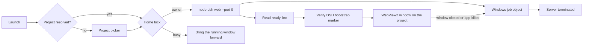

# DeepSeek Harness Desktop App

**A native Windows desktop app for DeepSeek Harness — it starts the harness server on launch, opens straight into your project, and shuts the server down when you close the window.**


DeepSeek Harness normally runs as `dsh web` in a terminal and is opened in a browser tab. This app removes that step: one executable boots the harness, renders its interface in an embedded WebView2 window, and owns the server lifecycle end to end. No terminal, no browser profiles, no manual start or stop.

> **Project status:** this is a working baseline, built and verified against `@deepseek-ai/dsh` 0.1.2-rc.1 on Windows 11. The launch, attach, and shutdown paths are tested. Settings persistence, log rotation, and a signed updater are not implemented yet. See [Current status](#current-status).

---

## Screenshots

*The DeepSeek Harness UI inside the native window, with the window icon and title bar themed to match the page.*


*Window chrome follows the rendered page — dark page, dark title bar.*


## Why this exists

Running the harness by hand means opening a terminal, changing into a project directory, typing a command, copying a tokenized URL, and remembering to stop the server afterwards. That is friction on every session, and it is easy to leave an orphaned server holding a port.

This app turns that sequence into a double-click, and makes the server's lifetime the same as the window's lifetime:

- no terminal and no command to remember;
- the window opens on the project you selected, not a generic dashboard;
- the port is chosen by the operating system, so there is nothing to conflict with;
- closing the window stops the server, and so does crashing the app.

The goal is a dependable desktop shell for a local harness — not a launcher script with a window bolted on.

## What it does

- **No-terminal launch** — starts `dsh web --no-open` as a hidden child process. No console window is ever shown.
- **Remembers your project** — the chosen folder, home, and port are saved to `settings.json`. Later launches open the same project with no flags; the first launch shows a picker with your recent projects.
- **Opens your project** — `--project <dir>` becomes the server's working directory, which is what scopes the harness workspace. The window title shows the project name.
- **OS-assigned port** — starts with `--port 0` and reads the real address from the ready line the harness prints, so port conflicts cannot happen.
- **Verified endpoint** — confirms the served root document contains the DSH bootstrap global before showing it, so an unrelated local service is never embedded.
- **Guaranteed shutdown** — the child is assigned to a Windows job object with kill-on-close. When the app exits, crashes, or is force-killed, the server and its descendants are terminated by the OS.
- **One server per home** — a named mutex keyed by `DSH_HOME` means a second launch hands focus to the running window instead of starting a second writer over the same session files.
- **Tray icon** — minimizing hides the window to the tray; the menu reopens it, opens the project folder or the log directory, and stops the server.
- **Bounded logs** — `desktop.log` rotates at 4 MB and old server logs are pruned at startup.
- **Dedicated data home** — the app uses its own `DSH_HOME` by default and never touches a harness home you did not point it at.
- **Opt-in updates** — `--update` runs `npm install -g @deepseek-ai/dsh@latest` behind a lock and validates the CLI before booting. Without the flag, a launch never mutates a working install.
- **Theme-aware window** — the title bar and border follow the rendered page background, and the window icon follows the Windows theme.

## How it works



### Launch sequence

1. The app loads `settings.json` and resolves the project: `--project`, then the remembered folder, then an interactive picker with the recent list.
2. It resolves `node` and the global `@deepseek-ai/dsh` entry, then validates that the CLI loads.
3. It acquires the per-home mutex. If another instance owns the home, it signals that window to come forward and exits.
4. It spawns `dsh web --no-open --host 127.0.0.1 --port 0` with the project as the working directory and the chosen `DSH_HOME`.
5. The child is assigned to a kill-on-close job object before any output is consumed.
6. The app reads the child's stdout for the ready line — `dsh web: http://127.0.0.1:<port>/?token=<token>` — which carries both the port and the access token.
7. It probes that authenticated URL and requires the DSH bootstrap marker in the root document.
8. The WebView2 window opens on that URL. The lease (PID, start time, port, URL, project) is persisted for other instances, and the resolved choices are saved to `settings.json`.
9. On close, the app kills the exact child it started, disposes the job handle, and removes the lease.

## Requirements

| Requirement | Notes |
|---|---|
| Windows 10/11 x64 | Windows 11 22H2 or newer enables the full title-bar theming |
| WebView2 Runtime | Preinstalled on Windows 11 and most Windows 10 machines; the window shows the official install link if missing |
| Node.js | Required by the harness itself |
| `@deepseek-ai/dsh` | Installed globally: `npm install -g @deepseek-ai/dsh` |
| .NET 8 SDK | Only to build from source; the published portable build bundles the runtime |

## Quick start

### Run a published build

1. Download `DeepSeekHarness-win-x64-<version>.zip` from Releases.
2. Unzip anywhere and run `DeepSeekHarness.exe`.
3. The first launch shows a project picker; choose the folder to open. The choice is remembered.
4. A few seconds later the window opens on that project.

Close the window to stop the server.

### Build from source

```powershell
git clone https://github.com/desanv01/deepseek-harness-desktop-app.git
cd deepseek-harness-desktop-app

# framework-dependent dev build -> dist\ (needs the .NET 8 runtime)
.\build.ps1

# self-contained single-file exe -> release\ (no .NET needed on the target)
.\build_portable.ps1
```

Open `DeepSeekHarness.sln` in Visual Studio and use the `PortableFolder` or `PortableSingleFile` publish profile if you prefer the Publish dialog.

## Command-line reference

```
DeepSeekHarness.exe                              normal launch (own server, OS-picked port)
DeepSeekHarness.exe --project C:\work\my-repo    open that workspace in the window
DeepSeekHarness.exe --dsh-home C:\dsh-home       use a specific harness home
DeepSeekHarness.exe --port 8080                  pin the port instead of letting the OS pick
DeepSeekHarness.exe --update                     update the global dsh first (opt-in)
DeepSeekHarness.exe --self-test                  environment report and exit
DeepSeekHarness.exe --stop                       stop the server this app started
DeepSeekHarness.exe --no-window                  headless boot test: start, verify, stop
```

| Flag | Default | Meaning |
|---|---|---|
| `--project <dir>` | remembered project, else picker | Working directory of the managed server: the workspace the window opens |
| `--dsh-home <dir>` | remembered home, else `%LOCALAPPDATA%\DeepSeekHarness\home` | `DSH_HOME` for the managed server; one server owns one home |
| `--port <n>` | `0` (OS picks a free port) | Pin the listen port; the real port is read from the ready line either way |
| `--address <host>` | `127.0.0.1` | Bind address for the managed server |
| `--ready-timeout <sec>` | `240` | How long to wait for the server's ready line |
| `--update` | off | Run `npm install -g @deepseek-ai/dsh@latest` before boot |
| `--no-update` | on | Explicit alias that keeps updates off |
| `--no-window` | off | Owned-mode boot test with no UI |
| `--self-test` | off | Print an environment report and exit |
| `--stop` | off | Stop the managed server for the selected home (exit 1 when none was found) |

Command-line flags always win over `settings.json`; anything not named on the command line falls back to the remembered value.

Exit codes: `0` success, `1` runtime error or nothing to stop, `2` invalid arguments, `10`–`14` toolchain problems, `21`/`22` server start or verification failure, `30` endpoint occupied, `40` home owned by another instance.

## Where things live

| What | Where |
|---|---|
| Sessions, settings, storages | `DSH_HOME` — default `%LOCALAPPDATA%\DeepSeekHarness\home` |
| App settings | `%LOCALAPPDATA%\DeepSeekHarness\settings.json` — last project, home, port, recent projects |
| App logs | `%LOCALAPPDATA%\DeepSeekHarness\logs\` (`desktop.log` plus `desktop.log.1` after rotation, unique `server-*.out/err.log`, unique `npm-update-*.log`) |
| Server lease | `%LOCALAPPDATA%\DeepSeekHarness\instance-<home-key>.json` — PID, start time, port, URL; removed on clean stop |
| WebView2 local state | `%LOCALAPPDATA%\DeepSeekHarness\webview2\` — safe to delete |
| Build artifacts | `dist\` and `release\` (git-ignored) |

Deleting `settings.json` simply restores the first-run picker; it holds no credentials.

## Project structure

```text
src/DeepSeekHarness/
├── Program.cs             # entry point, DPI awareness, log pruning, error handling
├── Options.cs             # CLI parsing, validation, settings precedence
├── Settings.cs            # settings.json: last project, home, port, recent projects
├── Orchestrator.cs        # project resolution, boot, focus handoff, window lifetime
├── ProjectPickerForm.cs   # first-run / recent-project chooser
├── ServerManager.cs       # spawn dsh, parse the ready line, lease, stop
├── JobObject.cs           # Win32 job object (kill-on-close)
├── SingleInstance.cs      # focus event that brings the owning window forward
├── Proc.cs                # child process run/spawn/kill, output draining
├── ManagedLock.cs         # per-home named mutex
├── NetProbe.cs            # endpoint identity probe (DSH bootstrap marker)
├── Tools.cs               # node/npm/dsh discovery and CLI validation
├── Updater.cs             # opt-in serialized npm update
├── AppPaths.cs            # %LOCALAPPDATA% layout, home keys, log pruning
├── MainForm.cs            # WebView2 window, theme measurement, tray handoff
├── TrayIcon.cs            # tray icon and its menu
├── SplashForm.cs          # startup splash with live status
├── Theme.cs               # shared palette and embedded artwork
├── NativeTheme.cs         # DWM dark mode and caption colours
├── SelfTest.cs            # --self-test report
├── Log.cs                 # rotating, never-throwing file + console logger
└── Ui.cs                  # message-box error surface
assets/                    # official DeepSeek artwork (regenerated by tools\update-icons.ps1)
screenshots/               # README images
build.ps1                  # dev / portable-folder / single-file builds
build_portable.ps1         # one self-contained exe + zip
```

## Troubleshooting

- **Window shows "Starting …" for a long time** — run `DeepSeekHarness.exe --self-test`, raise `--ready-timeout`, and read the newest `server-*.out.log`.
- **`WebView2 failed to initialize`** — the WebView2 Runtime is missing; the window shows the official install link.
- **`@deepseek-ai/dsh is not installed globally`** — run `npm install -g @deepseek-ai/dsh`, or launch with `--update`.
- **"Another instance owns this home"** — a second window is already serving the same `DSH_HOME`. A normal launch would just bring that window forward; this message means the owner is alive but its server did not answer, so close it (or run `--stop`) and retry.
- **The project picker appears every launch** — `settings.json` could not be written (check permissions on `%LOCALAPPDATA%\DeepSeekHarness`), or the remembered folder was moved or deleted. Pick the project again to re-record it.
- **Port already in use** — only possible when you pin one with `--port`; the default `--port 0` cannot conflict.
- **A server survived a crash** — the job object normally prevents this; if it ever happens, `DeepSeekHarness.exe --stop` stops only the lease whose PID and process start time still match.

## Current status

Verified on Windows 11 x64 with .NET 8, WebView2 `152.0.4191.66`, and `@deepseek-ai/dsh` `0.1.2-rc.1`:

- `dotnet build -c Release` — clean build;
- headless boot (`--no-window`) — OS-assigned port, ready line parsed in ~8 s, endpoint verified, server stopped;
- GUI launch with `--project` — settings written with the project, home, port, and recent list;
- second launch with no flags — resolves the project from settings, brings the running window forward, and exits without starting a second server;
- force-kill of the app — the managed server is gone within seconds;
- `--stop`, invalid `--port`, unknown flag, missing `--project` — correct exit codes.

Known limitations:

- The app cannot attach to a `dsh web` server it did not start, because a foreign server never publishes its token. It reports the conflict instead of guessing.
- One window per home: two projects need two homes (`--dsh-home`) rather than two windows over one server.
- There is no self-update mechanism. Any future updater must verify a signature or a published hash rather than replacing the executable from an unverified download.
- No automated test suite or CI is present; the checks above were run by hand.

## Roadmap

- [x] No-terminal launch with a hidden child process
- [x] Project-scoped window
- [x] OS-assigned port and ready-line discovery
- [x] Endpoint verification before display
- [x] Job-object shutdown guarantee
- [x] One server per home with attach
- [x] Persisted settings and a project picker
- [x] Log rotation and retention limits
- [x] Single-instance window with focus-on-relaunch
- [x] Tray icon and "open logs" menu
- [ ] Signed self-update (hash or signature verified)
- [ ] Unit tests for options, lease validation, and the endpoint probe
- [ ] GitHub Actions build and release workflow

## Security

- The app talks only to a loopback harness server; harness data stays in local files under `DSH_HOME`.
- The harness access token is passed to the embedded browser in the URL and is never logged by the app.
- The app performs no telemetry and makes no outbound requests other than an optional npm update and the GitHub release check.
- `--update` mutates the global `@deepseek-ai/dsh` installation; use it deliberately.
- Report sensitive issues through GitHub's private security advisory flow rather than a public issue.

## Contributing

Keep changes focused and explain the user-visible impact. Bug reports are most useful with reproduction steps, the exact flags used, the relevant `server-*.out.log` excerpt, and the `--self-test` output.

## License and attribution

Licensed under the [MIT License](LICENSE).

This project is a derivative of [`ZeroHackz/deepseek-harness-windows-native`](https://github.com/ZeroHackz/deepseek-harness-windows-native); the original MIT notice is preserved. The lifecycle model here was rebuilt around an OS-assigned port, a verified ready line, per-home ownership, and a kill-on-close job object.

DeepSeek Harness itself is developed by DeepSeek. This app is an independent wrapper: it is not affiliated with or endorsed by DeepSeek, and DeepSeek logos are used only to identify the wrapped application.

---

*A dependable desktop shell for a local DeepSeek Harness: double-click, work, close.*
